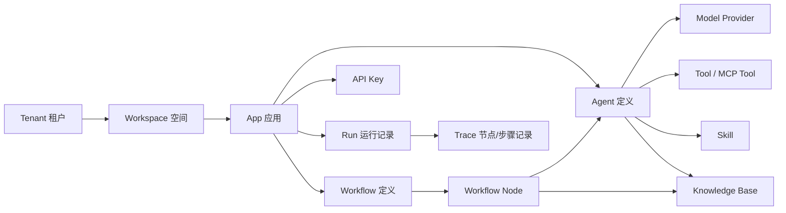

# Aio 产品范围设计

## 1. 产品目标

Aio 是一个轻量 AI Agent 与流程应用平台，面向两类场景：

1. SaaS 服务
   - 面向多个企业租户提供统一的 AI 应用创建、发布、运行、计量和运维能力。

2. 私有化部署
   - 面向单个企业内网部署，提供 Docker Compose 一键启动能力。
   - 支持企业使用自己的模型网关、向量库、对象存储和业务系统 API。

第一版的核心目标不是复制 Dify 的全部能力，而是覆盖最常用的生产闭环：

1. 建应用。
2. 接模型。
3. 接知识库。
4. 接工具。
5. 对外提供 API。
6. 有运行日志和调试能力。
7. 能 SaaS 运行，也能私有化部署。

## 2. 目标用户

| 角色 | 诉求 |
| --- | --- |
| 平台管理员 | 维护租户、模型供应商、系统配置、私有化部署参数 |
| 应用管理员 | 创建 Agent、流程应用、知识库、API Key、发布版本 |
| 业务配置人员 | 通过界面配置提示词、工具、知识库、流程节点 |
| 开发者 | 通过 API 调用应用，注册工具或 MCP 服务 |
| 运营人员 | 查看调用日志、失败原因、成本、命中知识、用户反馈 |

## 3. 应用类型

### 3.1 Agent 应用

Agent 应用用于处理对话、任务执行和业务问答。

最小能力：

1. 模型配置
   - 支持 OpenAI Compatible 接口。
   - 支持每个 Agent 指定模型、温度、最大 token、超时。

2. Prompt 配置
   - system prompt
   - 变量
   - 开场白
   - 失败兜底回复

3. 工具调用
   - HTTP Tool
   - 内置工具
   - MCP Tool
   - 后续扩展代码工具和数据库工具

4. 技能
   - 技能是可复用的提示词、工具、知识库、参数组合。
   - 第一版技能不做独立运行时，只作为 Agent 配置片段复用。

5. 知识库
   - 一个 Agent 可挂载多个知识库。
   - 支持检索 TopK、相似度阈值、重排开关。

6. 运行模式
   - Chat：多轮对话。
   - Completion：单轮文本生成。
   - Task：一次性任务执行。

### 3.2 流程应用

流程应用用于可视化编排确定性流程。

第一版建议只支持有向无环图 DAG，不引入完整 BPMN。

最小节点：

| 节点 | 用途 |
| --- | --- |
| Start | 定义输入参数 |
| LLM | 调用模型 |
| Agent | 调用已发布 Agent |
| Knowledge Retrieval | 检索知识库 |
| HTTP Request | 调用外部接口 |
| Code | 执行轻量脚本，私有化默认可关闭 |
| Condition | 条件分支 |
| Variable | 变量赋值、JSON 提取 |
| User Confirm | 等待用户确认、拒绝或选择动作 |
| User Form | 等待用户填写表单并提交 |
| End | 输出结果 |

第一版不做：

1. 复杂循环。
2. 长事务补偿。
3. 复杂多级审批流。
4. 多人协作画布。
5. 复杂调度中心。

第一版需要支持 Human-in-the-loop 的最小闭环：

1. 流程执行到用户确认或用户表单节点时进入 `waiting` 状态。
2. 平台生成等待任务 `wait_task`。
3. 外部系统可以通过 API 查询等待任务、渲染确认页或表单页。
4. 用户提交后，外部系统通过恢复 API 让流程从暂停节点继续执行。
5. 等待任务支持过期、取消、拒绝、幂等提交和审计记录。

### 3.3 知识库

知识库是平台级资源，可被 Agent 和流程应用挂载。

最小能力：

1. 数据集管理
   - 创建、编辑、归档。
   - 绑定租户和空间。

2. 文档管理
   - 上传文件。
   - URL 导入。
   - 纯文本导入。
   - API 写入。

3. 解析和索引
   - 文档解析。
   - 分段。
   - Embedding。
   - 向量入库。

4. 检索 API
   - 关键词检索。
   - 向量检索。
   - 混合检索。

5. 对外 API
   - 管理数据集。
   - 上传文档。
   - 查询解析状态。
   - 检索知识片段。

## 4. MVP 边界

### 4.1 第一版必须做

1. 租户与空间
   - SaaS 必须有租户。
   - 私有化可以默认单租户。

2. 模型供应商
   - OpenAI Compatible 作为统一协议。
   - 国内模型通过 compatible 网关接入。

3. Agent 创建与调试
   - Prompt、模型、知识库、工具配置。
   - 测试窗口。
   - 发布版本。

4. 简单流程画布
   - DAG 节点编排。
   - 用户确认节点。
   - 用户表单节点。
   - 流程暂停和恢复。
   - 节点运行日志。
   - 手动测试和 API 调用。

5. 知识库
   - 文件上传。
   - 文本解析。
   - 分段入库。
   - 检索测试。

6. API Key 与对外调用
   - 应用调用 API。
   - 知识库 API。
   - 运行日志 API。

7. 观测
   - 每次运行有 run id。
   - 每个节点有 trace。
   - 记录模型 token、耗时、错误信息。

8. Docker Compose
   - API 服务。
   - Web 管理端。
   - Worker。
   - Postgres。
   - Redis。
   - MinIO。
   - Qdrant。

### 4.2 第一版暂不做

1. 插件市场。
2. 多 Agent 自动协作。
3. 复杂权限模型。
4. 工作流多人实时协同。
5. 多区域容灾。
6. 模型训练和微调。
7. 复杂计费账单。
8. Helm Chart。

## 5. 产品对象关系

## 6. 轻量化原则

1. 一个产品模型同时服务 SaaS 和私有化。
2. 私有化不分叉代码，只通过配置关闭多租户、计量、外部登录。
3. 所有外部能力优先抽象为 Provider。
4. 所有运行过程统一用 `Run` 和 `Trace` 观测。
5. 复杂功能以扩展点形式预留，不在第一版落重实现。
