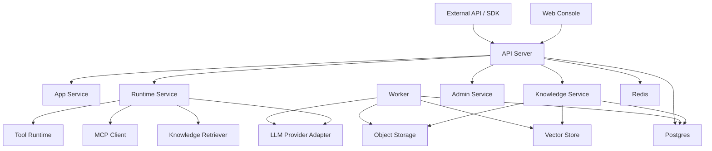
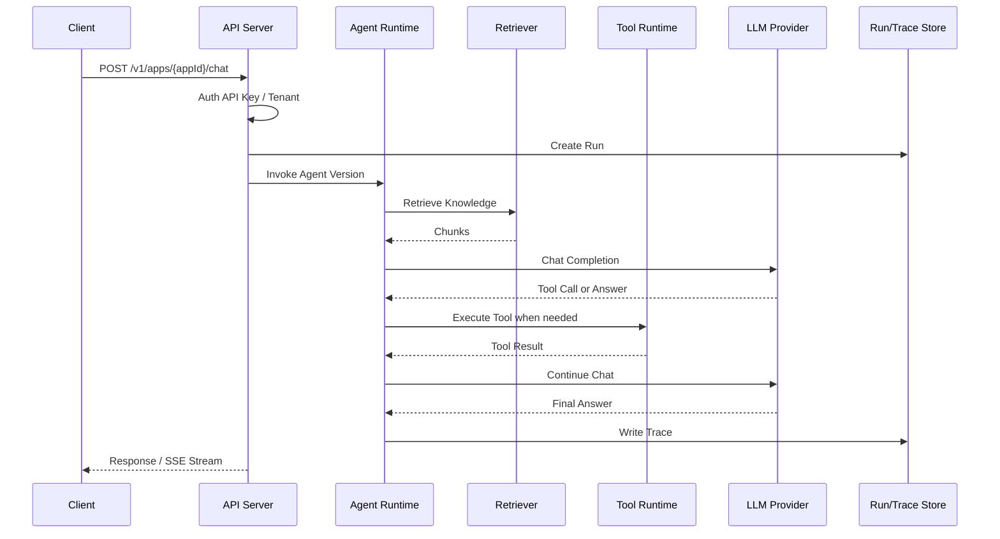
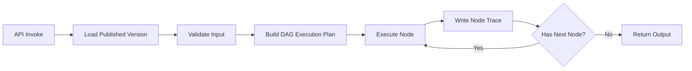
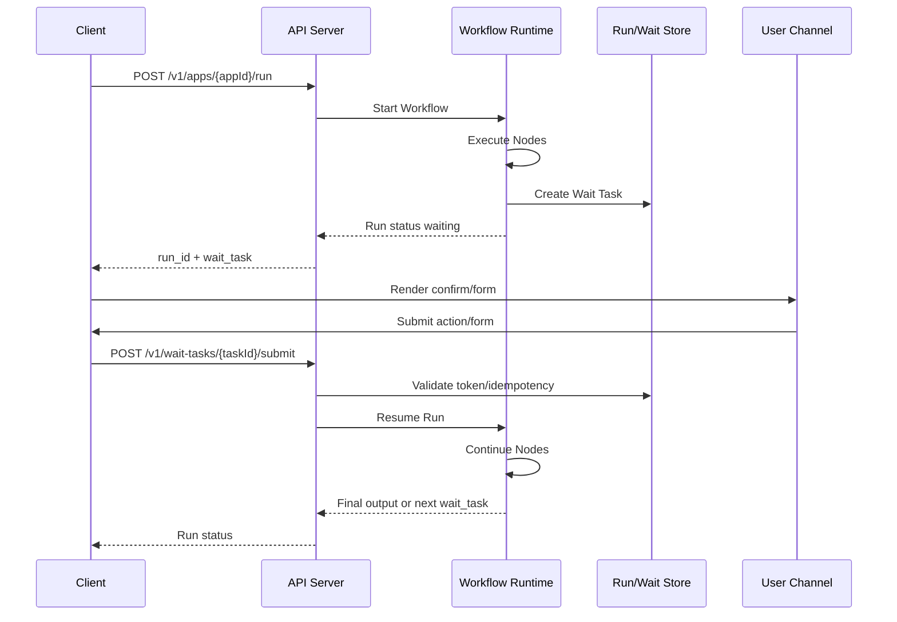
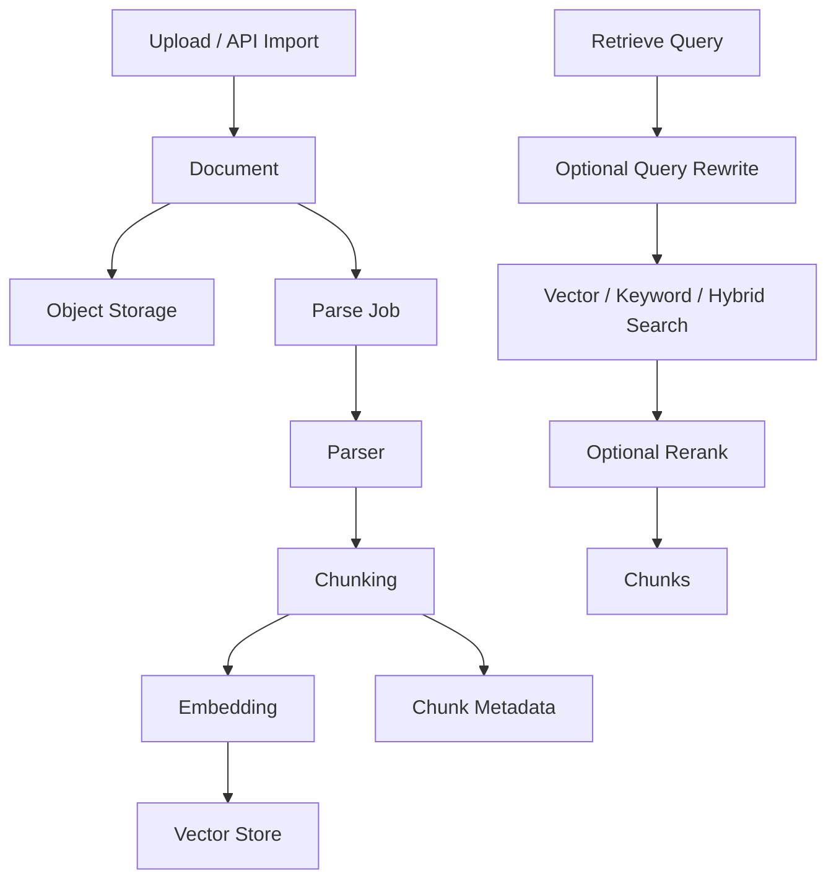

# Aio 最小架构设计

## 1. 架构结论

从最快最轻量角度，推荐第一版采用：

1. `aio` 单应用容器：同时承载 Web 静态资源、API Server 和 Worker Runtime。
2. 管理前端：Vue/React 单页应用，构建后打包进 `aio` 镜像，由同一容器提供访问。
3. 后端 API：单体服务，负责管理 API、运行 API、鉴权、调度入口。
4. Worker Runtime：作为同容器内的后台线程、队列消费者或 supervisor 子进程，负责知识库解析、Embedding、异步流程节点、重试。
5. Postgres：主数据库，保存租户、应用、配置、运行记录。
6. Redis：缓存、队列、限流、短期会话。
7. MinIO/S3：文件对象存储。
8. Qdrant/pgvector：向量检索。私有化推荐 Qdrant，极简部署可用 pgvector。

不建议第一版拆成大量微服务。拆得太早会让私有化部署、升级、排障和版本兼容成本迅速上升。

部署上不把 API、Web、Worker 拆成 3 个容器。它们是同一个 `aio` 容器里的逻辑组件；后续规模变大时，可以通过配置把 Worker 单独拉成副本，但第一版交付不暴露这种复杂度。

## 2. 逻辑分层

## 3. 后端模块

| 模块 | 职责 |
| --- | --- |
| Identity | 用户、租户、空间、角色、API Key |
| Provider | 模型供应商、Embedding 供应商、重排供应商 |
| App | 应用定义、版本、发布、访问控制 |
| Agent | Agent 配置、Prompt、工具、知识库挂载 |
| Workflow | 流程定义、节点、边、变量、版本 |
| Tool | HTTP 工具、内置工具、MCP 工具注册 |
| Skill | 可复用能力包，第一版作为配置模板 |
| Knowledge | 知识库、文档、分段、索引、检索 |
| Runtime | Agent 运行时、Workflow 运行时、Run/Trace |
| Observability | 日志、耗时、token、错误、反馈 |
| Deployment | 私有化配置、健康检查、系统信息 |

## 4. 运行时链路

### 4.1 Agent 调用链路

### 4.2 Workflow 调用链路

第一版 Workflow 需要支持两类运行方式：

1. 短流程同步执行。
2. 遇到用户确认或用户表单节点时暂停，生成等待任务，后续通过恢复 API 继续执行。

### 4.3 Human-in-the-loop 调用链路

等待任务是开放 API 的核心对象。外部系统可以选择：

1. 由平台返回 `wait_task` 后自行渲染用户界面。
2. 调用平台的管理端页面展示确认或表单。
3. 订阅 webhook，在流程等待、恢复、完成、失败时接收事件。

## 5. MCP、技能、工具关系

### 5.1 Tool

Tool 是可被 Agent 或 Workflow 节点调用的最小执行单元。

第一版 Tool 类型：

1. `http`
   - 管理员配置 URL、方法、Header、参数 schema。
   - 运行时根据模型 tool call 参数执行。

2. `builtin`
   - 平台内置能力，例如时间、JSON 处理、知识库检索。

3. `mcp`
   - 通过 MCP Server 暴露的工具。
   - 平台保存 MCP Server 连接配置，运行时拉取 tools list。

### 5.2 Skill

Skill 是一组可复用能力模板，不直接作为独立服务运行。

一个 Skill 可以包含：

1. Prompt 片段。
2. Tool 引用。
3. Knowledge Base 引用。
4. 输入变量 schema。
5. 输出格式要求。

第一版 Skill 的价值是减少重复配置。运行时仍展开成 Agent 配置执行。

### 5.3 MCP Server

MCP Server 是外部能力接入源。

建议第一版支持两种连接模式：

1. SSE/HTTP MCP
   - 适合 SaaS 和私有化。
   - 服务端无需启动本地命令。

2. stdio MCP
   - 私有化可选。
   - SaaS 默认关闭，避免任意命令执行风险。

## 6. 知识库架构

最小实现建议：

1. 文档原文放对象存储。
2. 文档元数据和分段元数据放 Postgres。
3. 向量放 Qdrant 或 pgvector。
4. 解析任务走 Redis 队列。
5. Embedding 失败允许重试。

## 7. 多租户策略

SaaS 和私有化使用同一套表结构。

| 能力 | SaaS | 私有化 |
| --- | --- | --- |
| tenant_id | 必填 | 默认 `default` |
| workspace_id | 必填 | 可只有一个默认空间 |
| API Key | 按租户隔离 | 可全局管理 |
| 模型供应商 | 租户级或平台级 | 默认私有化全局 |
| 存储桶 | 可按租户前缀隔离 | 单桶即可 |
| 向量集合 | 可按租户集合或 metadata 过滤 | 单集合即可 |

第一版建议使用 `tenant_id + workspace_id` 字段做逻辑隔离，不先做独立数据库隔离。

实现时必须把租户隔离作为强制约束，而不是只依赖业务约定：

1. 所有管理 API、运行 API、后台 Worker 查询都必须从鉴权上下文解析 `tenant_id` 和 `workspace_id`，并在数据访问层统一追加过滤条件。
2. API Key 必须绑定租户、可选绑定空间和应用 scope；运行 `/v1` API 时不能只凭 `app_id` 查应用，必须同时校验 API Key scope、应用归属和发布状态。
3. Postgres 中所有租户级业务表必须包含 `tenant_id`；空间级对象必须同时包含 `workspace_id`，并建立组合索引避免遗漏过滤导致性能退化。
4. 对象存储必须使用租户前缀隔离，例如 `tenants/{tenant_id}/workspaces/{workspace_id}/...`，服务端生成 object key，禁止客户端提交任意 object key。
5. 向量检索必须强制带 `tenant_id`、`workspace_id`、`dataset_id` metadata filter；如果向量库不支持可靠 filter，SaaS 模式应使用按租户或按数据集集合隔离。
6. Redis key、队列任务、幂等键、缓存 key 必须包含租户维度，避免异步任务、限流、缓存结果跨租户串用。
7. Trace、Run、Wait Task、Webhook 事件查询必须按租户校验归属；匿名 Wait Task token 只能映射到单个任务，不能反查 Run、Trace 或应用配置。
8. 管理端列表接口默认只能返回当前租户和空间数据；平台管理员跨租户操作必须走独立权限和审计日志。

## 8. 扩展点

| 扩展点 | 第一版实现 | 后续演进 |
| --- | --- | --- |
| Model Provider | OpenAI Compatible | 原生适配更多供应商 |
| Vector Store | Qdrant/pgvector 二选一 | Milvus、Elasticsearch hybrid |
| Tool | HTTP、Builtin、MCP | 数据库工具、代码工具、浏览器工具 |
| Workflow Node | 注册式节点 | 插件化节点包 |
| Auth | 本地账号/API Key | SSO、OIDC、企业微信/飞书登录 |
| Runtime | 单体内执行 + Worker | 独立 Runtime 服务、沙箱执行 |
