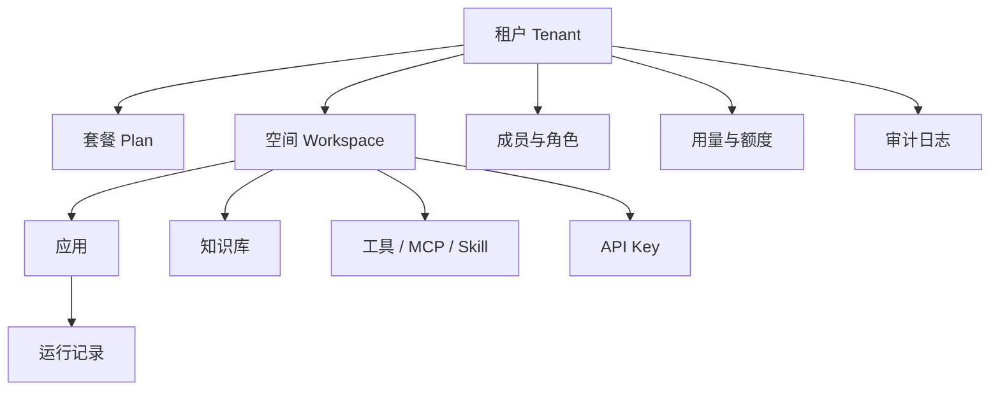
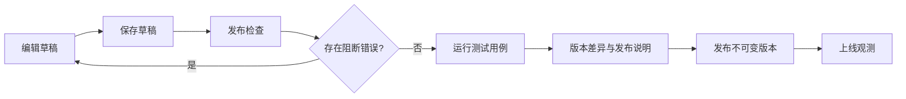
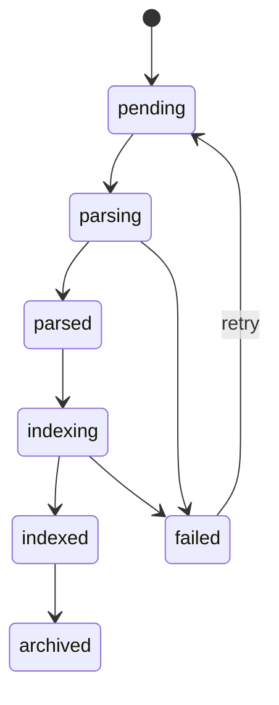
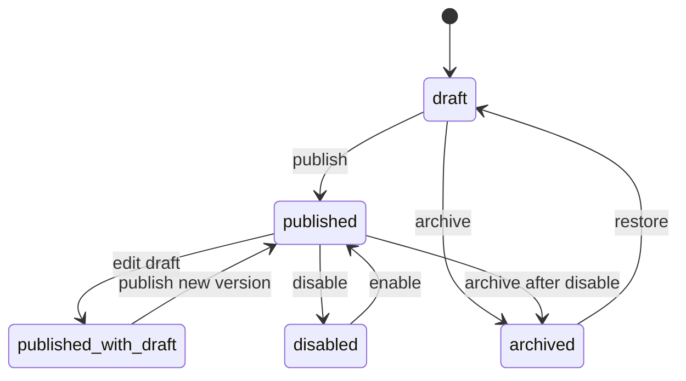
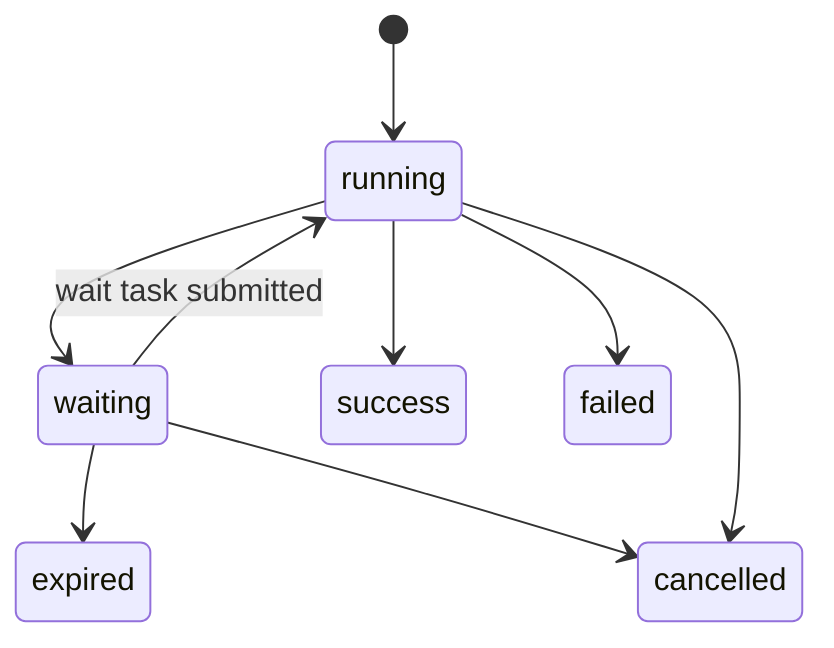

# Aio 控制台界面与业务逻辑设计

## 1. 文档定位

本文补充 `Aio` 控制台的界面、信息架构、页面功能和关键业务逻辑，避免开发只按后端对象推进而偏离产品体验。

设计参考 Dify 和阿里云百炼等成熟平台的交互范式，但不照搬视觉或文案。Aio 的产品定位是：

1. SaaS 可运营：天然支持租户、空间、成员、额度、用量、审计和 API 服务化。
2. 私有化可交付：同一套界面在私有化默认单租户模式下可直接使用。
3. 应用中心优先：用户进入平台后首先看到可创建、管理、发布、调用的 AI 应用。
4. API 友好：每个应用、知识库、等待任务都能从界面直接获得调用文档、示例和密钥指引。
5. 运行可观测：Agent 对话、工具调用、知识检索、Workflow 节点执行都能追踪、排障和复现。

## 2. 设计原则

| 原则 | 说明 |
| --- | --- |
| 应用即入口 | 应用中心是默认首页，不把模型、工具、知识库等底层能力放在第一视觉层级。 |
| 创建先分型 | 创建应用时先选择 Chatflow、Agent、文本生成、Workflow 等类型，再进入对应设计页面。 |
| 复杂设计独立页面 | Workflow 画布必须使用独立全屏设计页，避免在应用中心塞入复杂画布。 |
| 配置和调试同屏 | Agent 和 Workflow 设计页都应支持“配置 + 调试 + 发布检查”闭环。 |
| 发布必须可控 | 发布前必须做结构校验、依赖校验、权限校验、测试用例校验和风险提示。 |
| API 即产品 | 对外 API 文档、密钥、示例、SDK 和 Webhook 必须在控制台内可直接复制使用。 |
| 观测可定位 | Run、Trace、节点日志、模型 token、工具入参出参、错误栈必须可定位到应用版本和节点。 |
| SaaS 隔离显式 | 租户、空间、套餐、额度、成员、审计要在界面可见，避免私有化思维限制 SaaS 演进。 |
| 紧凑科技蓝 | 视觉采用科技蓝、白底卡片、浅灰边界、紧凑间距，不使用大面积无信息 hero。 |

## 3. 信息架构

### 3.1 全局导航

控制台采用顶部栏 + 左侧栏 + 主工作区。

```text
Aio Logo / 当前租户 / 当前空间 / 全局搜索 / 帮助 / 通知 / 用户
├─ 应用中心
├─ 知识库
├─ 工具与 MCP
├─ API 与集成
├─ 运行观测
├─ 任务中心
├─ 模型供应商
├─ 组织与权限
├─ 用量与计费
└─ 系统设置
```

私有化默认可以隐藏“用量与计费”的收费字段，但保留用量统计入口。

### 3.2 页面路由建议

| 页面 | 路由 | 说明 |
| --- | --- | --- |
| 工作台概览 | `/console` | SaaS 总览、最近应用、运行状态、额度提醒。 |
| 应用中心 | `/console/apps` | 应用卡片平铺、筛选、搜索、创建入口。 |
| 创建应用 | `/console/apps/create` 或 Modal | 选择应用类型、模板、导入 DSL。 |
| Agent 设计 | `/console/apps/{appId}/agent` | Chatflow、Agent、文本生成配置与调试。 |
| Workflow 设计 | `/console/apps/{appId}/workflow` | 独立画布、节点配置、调试、发布检查。 |
| 应用 API 文档 | `/console/apps/{appId}/api` | 当前应用调用文档、密钥、示例。 |
| 应用版本 | `/console/apps/{appId}/versions` | 版本列表、差异、回滚、禁用。 |
| 知识库 | `/console/datasets` | 数据集列表、文档、分段、检索测试。 |
| 工具管理 | `/console/tools` | HTTP Tool、内置 Tool、测试。 |
| MCP 管理 | `/console/mcp` | MCP Server、工具同步、授权。 |
| Skill 管理 | `/console/skills` | 能力模板、应用到 Agent。 |
| API Key | `/console/api-keys` | 创建、scope、过期、轮换。 |
| API 文档中心 | `/console/developers/docs` | OpenAPI、SDK、Webhook、Wait Task 文档。 |
| 运行观测 | `/console/observability/runs` | Run 列表、Trace、日志、错误分析。 |
| 任务中心 | `/console/wait-tasks` | 用户确认、表单、外部回填任务。 |
| 模型供应商 | `/console/providers` | OpenAI Compatible、DashScope、私有模型网关。 |
| 组织与权限 | `/console/org` | 租户、空间、成员、角色。 |
| 用量与计费 | `/console/billing` | token、调用量、存储、套餐。 |
| 审计日志 | `/console/audit` | 登录、发布、密钥、工具调用、权限变更。 |

### 3.3 首次启动、登录和引导

| 场景 | 页面/交互 | 业务逻辑 |
| --- | --- | --- |
| SaaS 登录 | `/login` | 支持账号密码、SSO/OIDC，登录后进入最近访问空间。 |
| 私有化首次启动 | `/setup` | 创建默认管理员、默认租户、默认空间，配置基础模型供应商。 |
| 邀请加入 | `/invite/{token}` | 校验邀请 token，绑定租户和空间角色。 |
| 忘记密码 | `/forgot-password` | SaaS 发送邮件；私有化可由管理员重置。 |
| 新手引导 | 控制台内引导 | 引导完成“配置模型 -> 创建应用 -> 发布 -> 调用 API”。 |

首次进入控制台，如果没有可用模型供应商，应在应用中心顶部展示轻量提示，引导用户先配置 Provider；但不要阻止用户先创建草稿应用。

### 3.4 工作台概览

工作台概览不是大屏驾驶舱，而是紧凑运营首页，用于回答“当前空间是否健康”。

核心卡片：

1. 最近编辑应用。
2. 最近失败 Run。
3. 等待处理任务。
4. 近 24 小时调用量、失败率、平均耗时。
5. 当前额度和资源告警。
6. 快捷入口：创建应用、上传知识、创建 API Key、查看 API 文档。

### 3.5 视觉与布局基线

1. 主色使用科技蓝，强调发布、运行、API 等关键动作。
2. 页面背景使用浅灰蓝，内容区使用白色卡片和浅边框。
3. 顶部栏高度控制在 56 到 64px，左侧栏宽度控制在 200 到 240px。
4. 列表和卡片优先展示可执行信息，避免大面积宣传文案。
5. 应用中心默认卡片平铺；设计器和观测页允许全屏密集布局。
6. 所有危险动作使用二次确认，并展示影响范围。
7. 所有长文本配置项支持展开编辑、变量插入和快捷测试。

## 4. SaaS 服务体现

### 4.1 SaaS 对象层级



### 4.2 顶部租户与空间切换

顶部栏必须展示当前租户和空间：

1. SaaS 模式：显示租户下拉、空间下拉、套餐标识、额度状态。
2. 私有化模式：默认显示“Default Workspace”，租户切换可隐藏或只读。
3. 切换空间后，应用、知识库、工具、API Key、运行日志列表全部按空间刷新。
4. 跨空间资源引用必须显式授权，不允许默认互通。

### 4.3 SaaS 页面能力

| 页面 | SaaS 必须体现的能力 |
| --- | --- |
| 组织与权限 | 租户成员、空间成员、角色、邀请、禁用。 |
| 用量与计费 | 调用次数、token、知识库存储、向量数量、并发额度、套餐限制。 |
| API Key | Key 绑定租户、空间、应用 scope，支持到期时间和限流。 |
| 审计日志 | 发布、回滚、删除、密钥创建、工具变更、权限变更全记录。 |
| 系统设置 | SaaS 显示租户级设置；私有化显示部署、License、外部依赖状态。 |

### 4.4 额度和限流交互

1. 当租户调用量超过 80% 时，顶部通知和用量页提示。
2. 创建应用、发布应用不受额度影响；运行 API 受额度影响。
3. API 返回 429 或 402 风格错误时，控制台的运行日志应显示“额度不足/限流”而不是普通失败。
4. 私有化模式默认不阻断，只展示用量统计和资源告警。

## 5. 应用中心设计

### 5.1 页面目标

应用中心是默认工作页，目标是让用户快速完成：

1. 查看已有 Agent / Workflow 应用。
2. 创建不同类型智能体应用。
3. 从模板或 DSL 导入应用。
4. 进入设计、测试、发布、API 文档和运行观测。

### 5.2 页面布局

```text
页面标题：应用管理                                      [使用指南] [创建应用]
筛选：全部 / Agent / Workflow / 已发布 / 草稿           搜索框 / 排序 / 刷新

+ 创建应用卡片     + 应用卡片     + 应用卡片     + 应用卡片
+ 模板创建         + 类型图标     + 状态标签     + 最近运行状态
+ 导入 DSL         + 名称         + 更新时间     + 快捷操作
```

不使用大面积 banner。卡片以 3 到 5 列自适应平铺，卡片内展示必要信息：

1. 应用类型：Chatflow、Agent、文本生成、Workflow。
2. 发布状态：草稿、已发布、有未发布变更、禁用、归档。
3. 最近更新时间和最近运行状态。
4. 快捷操作：设计、API、运行日志、更多。

### 5.3 创建应用流程

点击“创建应用”后打开弹窗或独立创建页。

第一步：选择创建方式。

| 创建方式 | 说明 |
| --- | --- |
| 空白创建 | 选择应用类型并输入名称。 |
| 从模板创建 | 从官方模板、租户模板、空间模板创建。 |
| 导入 DSL | 上传导出的 App DSL JSON。 |

第二步：选择应用类型。

| 类型 | 目标用户 | 进入页面 |
| --- | --- | --- |
| Chatflow / 聊天助手 | 客服问答、知识问答、多轮对话 | Agent 设计页的聊天助手模式 |
| Agent / 自主智能体 | 复杂任务规划、工具调用、业务执行 | Agent 设计页的自主智能体模式 |
| 文本生成 | 总结、改写、结构化输出、模板生成 | Agent 设计页的文本生成模式 |
| Workflow / 工作流 | 确定性流程、审批、编排、集成 | Workflow 独立画布页 |

第三步：基础信息。

1. 应用名称，必填，空间内不可重复。
2. 描述，可选。
3. 图标和颜色，可选。
4. 可见性：仅自己、空间可见、公开 API。
5. 创建后进入对应设计页，并自动保存草稿版本。

### 5.4 应用卡片业务逻辑

| 状态 | 卡片表现 | 可操作 |
| --- | --- | --- |
| `draft` | 灰色草稿标签 | 设计、发布、删除 |
| `published` | 蓝色已发布标签 | API、运行日志、设计新草稿、禁用 |
| `published_with_draft` | 蓝色已发布 + 橙色未发布变更 | 继续编辑、发布检查、版本差异 |
| `disabled` | 红色禁用标签 | 查看、启用、版本 |
| `archived` | 归档列表中展示 | 恢复、永久删除，默认不显示 |

应用删除必须二次确认。已发布应用默认不允许直接删除，必须先禁用或归档。

## 6. Agent 应用设计页

### 6.1 通用布局

Agent 设计页采用三栏或左右分栏：

```text
顶部：返回应用中心 / 应用名 / 草稿状态 / 保存 / 调试 / 发布
左侧：设计步骤导航
中间：配置表单
右侧：调试预览 / 变量 / 引用知识 / Trace 摘要
```

设计步骤：

1. 基础信息。
2. 模型配置。
3. Prompt 与变量。
4. 知识库。
5. 工具 / MCP / Skill。
6. 记忆与上下文。
7. 安全与输出。
8. 调试与发布。

### 6.2 Chatflow / 聊天助手设计

适合多轮对话、客服、知识问答。

必须字段：

1. 开场白。
2. 建议问题。
3. System Prompt。
4. 用户输入变量。
5. 模型和温度。
6. 知识库挂载与引用规则。
7. 多轮记忆窗口。
8. 兜底回复。

调试区能力：

1. 类聊天窗口交互。
2. 展示每轮输入、模型输出、知识命中、工具调用。
3. 一键保存当前测试为发布前测试用例。
4. 支持清空会话和切换变量。

### 6.3 Agent / 自主智能体设计

适合需要规划、工具调用、MCP、业务 API 的任务执行。

必须字段：

1. 角色目标：Agent 要完成什么任务。
2. 任务约束：禁止事项、权限边界、数据边界。
3. 规划策略：简单 ReAct、工具优先、知识优先。
4. 最大迭代次数。
5. 单步超时和总超时。
6. 可用工具列表。
7. MCP 工具列表。
8. 工具调用前是否需要确认。
9. 输出格式：自然语言、JSON Schema、Markdown。

调试区能力：

1. 显示思考步骤摘要，不暴露敏感内部链路。
2. 展示每次工具调用的入参、出参、耗时和错误。
3. 支持禁用某个工具后重跑。
4. 支持将失败样例保存为回归测试用例。

### 6.4 文本生成设计

适合总结、改写、报告生成、结构化抽取。

必须字段：

1. 输入变量 schema。
2. 生成模板。
3. 输出语言和风格。
4. 输出格式校验：纯文本、Markdown、JSON Schema。
5. 示例输入和期望输出。

调试区能力：

1. 表单化输入变量。
2. 生成结果预览。
3. JSON 输出校验结果。
4. 一键复制 API 请求示例。

### 6.5 Agent 发布逻辑

Agent 发布前必须执行检查：

| 检查项 | 阻断级别 | 说明 |
| --- | --- | --- |
| 模型供应商可用 | 阻断 | Provider 不存在、禁用或连接测试失败不可发布。 |
| Prompt 为空 | 阻断 | System Prompt 或生成模板为空不可发布。 |
| 变量未定义 | 阻断 | Prompt 引用了未定义变量。 |
| 知识库未索引完成 | 警告/阻断 | 默认警告；如果应用声明强依赖则阻断。 |
| 工具 schema 无效 | 阻断 | Tool input schema 不是合法 JSON Schema。 |
| MCP 工具未同步 | 警告 | 可以发布，但提示运行时可能不可用。 |
| JSON 输出无测试通过样例 | 警告 | 文本生成类应用建议至少有 1 个测试样例。 |
| 敏感信息暴露 | 阻断 | Prompt、Header、默认变量不得包含明文密钥。 |

发布后生成不可变版本。再次编辑会形成新草稿，不影响当前线上版本。

## 7. Workflow 独立设计页

### 7.1 为什么必须独立页面

Workflow 设计包含节点库、画布、连线、变量、节点调试、运行轨迹和发布检查，复杂度明显高于 Agent 表单。如果嵌在应用中心，会造成：

1. 画布空间不足。
2. 属性面板和调试面板冲突。
3. 节点运行状态无法直观展示。
4. 发布检查和版本差异难以承载。

因此 Workflow 必须使用独立全屏设计页。

### 7.2 页面布局

```text
顶部工具栏：返回 / 应用名 / 保存 / 撤销 / 重做 / 变量 / 运行测试 / 发布检查 / 发布
左侧节点库：基础 / AI / 数据 / 工具 / 控制 / 人工 / 输出
中间画布：节点、连线、缩放、框选、小地图
右侧属性面板：节点配置 / 输入输出 / 高级设置 / 调试记录
底部抽屉：运行日志 / Trace / 校验问题 / 测试用例
```

### 7.3 节点分类

| 分类 | 节点 | 说明 |
| --- | --- | --- |
| 基础 | Start、End、Variable | 输入、输出、变量赋值。 |
| AI | LLM、Agent、Text Generation | 调模型或调用已发布 Agent。 |
| 知识 | Knowledge Retrieval | 检索知识库。 |
| 工具 | HTTP Request、MCP Tool、Builtin Tool | 调外部 API 或 MCP 工具。 |
| 控制 | Condition、Parallel、Merge | 条件分支、并行和合并。第一版 Parallel 可延后。 |
| 人工 | User Confirm、User Form | 生成等待任务，支持恢复执行。 |
| 集成 | Webhook、External Callback | 对外回调或等待外部回填。 |

### 7.4 画布交互

1. 从节点库拖拽节点到画布。
2. 节点端口连线，只允许输出连输入。
3. 点击节点打开右侧属性面板。
4. 点击连线配置条件表达式。
5. 支持自动布局、缩放、小地图、框选删除。
6. 支持撤销和重做。
7. 节点运行后在画布显示状态：等待、运行中、成功、失败、跳过。

### 7.5 变量和表达式

Workflow 使用统一变量引用语法：

```text
{{inputs.question}}
{{nodes.retrieve.output.chunks}}
{{nodes.confirm.output.action}}
{{env.API_BASE_URL}}
```

变量面板展示：

1. 输入变量。
2. 节点输出变量。
3. 环境变量。
4. 系统变量：`run_id`、`app_id`、`user_id`、`tenant_id`。

表达式编辑器必须提供自动补全和引用校验。

### 7.6 节点调试

节点调试分三种：

| 调试方式 | 说明 |
| --- | --- |
| 单节点调试 | 使用手工输入或上游样例运行当前节点。 |
| 从当前节点运行 | 使用当前节点之前的缓存输出，从当前节点继续执行。 |
| 全流程测试 | 从 Start 节点开始运行完整流程，生成测试 run。 |

调试运行默认不影响线上发布版本，写入 `run_type=test`，可在观测页面过滤。

## 8. Workflow 发布可控性

### 8.1 发布流程



### 8.2 发布检查清单

| 检查项 | 阻断级别 | 规则 |
| --- | --- | --- |
| Start 节点唯一 | 阻断 | 必须且只能有一个 Start 节点。 |
| End 节点存在 | 阻断 | 至少一个 End 节点可达。 |
| DAG 无环 | 阻断 | 第一版不支持循环。 |
| 节点连通性 | 阻断 | 所有启用节点必须从 Start 可达，且能到达 End 或等待节点。 |
| 端口类型匹配 | 阻断 | 连线两端类型必须合法。 |
| 必填配置 | 阻断 | 每类节点必填字段不能为空。 |
| 变量引用存在 | 阻断 | 表达式引用的变量必须存在。 |
| JSON Schema 合法 | 阻断 | 输入、输出、表单、工具 schema 必须合法。 |
| Provider 可用 | 阻断 | LLM / Embedding Provider 必须启用且可连接。 |
| 工具授权 | 阻断 | HTTP Tool、MCP Tool 必须启用且具备调用权限。 |
| 知识库索引 | 警告/阻断 | 被强依赖的数据集未索引完成时阻断。 |
| User 节点恢复分支 | 阻断 | 确认、拒绝、超时至少要有明确处理策略。 |
| 超时与重试 | 警告 | 外部调用节点建议配置超时和重试。 |
| 敏感字段 | 阻断 | Header、URL、Prompt 不允许明文密钥。 |
| 测试用例 | 警告/阻断 | 生产级应用要求至少一个通过的测试用例。 |

### 8.3 发布结果

发布成功后：

1. 生成新的 `ai_app_version`，内容不可变。
2. 更新应用 `published_version_id`。
3. 写入审计日志：发布人、时间、版本、变更摘要。
4. 可选择生成 OpenAPI 片段和调用示例。
5. 可配置发布后冒烟测试，失败则提示但不自动回滚。

### 8.4 回滚与禁用

1. 版本列表支持回滚到历史已发布版本。
2. 回滚本质是把 `published_version_id` 指向历史版本，并写审计日志。
3. 禁用应用后，运行 API 返回明确错误，不删除版本和日志。
4. 删除版本只允许删除草稿版本；已发布版本不可物理删除。

## 9. 知识库管理设计

### 9.1 页面结构

```text
知识库列表
├─ 数据集详情
│  ├─ 文档管理
│  ├─ 分段管理
│  ├─ 检索测试
│  ├─ API 写入文档
│  ├─ 权限与挂载应用
│  └─ 设置
└─ 创建知识库向导
```

### 9.2 创建知识库向导

步骤：

1. 基础信息：名称、描述、图标、空间。
2. Embedding 配置：Provider、模型、维度。
3. 分段策略：固定长度、按标题、语义分段。
4. 检索策略：向量、关键词、混合、TopK、阈值、重排。
5. 权限：可挂载应用、可管理成员、API 写入权限。

### 9.3 文档管理

文档来源：

| 来源 | 说明 |
| --- | --- |
| 文件上传 | PDF、Word、Markdown、TXT、CSV。 |
| URL 导入 | 抓取网页内容。 |
| 文本粘贴 | 手工录入 FAQ 或片段。 |
| API 写入 | 外部系统同步知识。 |
| 批量导入 | zip 或目录结构，后续支持。 |

文档状态：



文档列表必须展示：解析状态、索引状态、分段数、token 数、更新时间、失败原因。

### 9.4 分段管理

分段页用于查看和修正解析结果：

1. 左侧文档目录。
2. 中间分段列表。
3. 右侧分段内容、metadata、向量状态。
4. 支持启用/禁用某个分段。
5. 支持手工编辑分段并触发重新 embedding。

### 9.5 检索测试

检索测试页必须支持：

1. 输入 query。
2. 调整 TopK、阈值、检索模式、重排开关。
3. 展示命中文档、分段、score、metadata。
4. 高亮命中内容。
5. 一键复制检索 API 示例。
6. 保存为 Agent 调试样例。

### 9.6 知识库挂载控制

1. 只有同空间或被授权的数据集可被应用挂载。
2. 知识库归档后，已发布应用仍可使用已索引数据，但新版本发布应警告。
3. 数据集删除必须检查是否被应用引用；被已发布应用引用时禁止删除。
4. API 写入必须绑定 API Key scope 和 dataset scope。

## 10. API 与开发者文档页面

### 10.1 页面目标

API 页面要让开发者不看外部文档也能完成调用。

必须提供：

1. 当前应用的 App ID、类型、发布状态、当前版本。
2. API Key 创建入口和 scope 说明。
3. Chat / Run / Wait Task / Trace / Knowledge API 示例。
4. curl、JavaScript、Java、Python 示例。
5. OpenAPI 下载。
6. Webhook 签名说明和测试发送。
7. 错误码和限流说明。

### 10.2 应用 API 文档页

Agent 应用展示：

1. `POST /v1/apps/{appId}/chat`
2. Blocking 示例。
3. Streaming SSE 示例。
4. 多轮会话 `conversation_id` 示例。
5. 输入变量说明。
6. 响应字段和 usage 说明。

Workflow 应用展示：

1. `POST /v1/apps/{appId}/run`
2. `response_mode=blocking|streaming|async`。
3. 输入 schema 自动生成表格。
4. `waiting` 响应示例。
5. Wait Task 查询和提交示例。
6. Run 和 Trace 查询示例。

知识库展示：

1. `POST /v1/datasets/{datasetId}/documents`
2. `POST /v1/datasets/{datasetId}/retrieve`
3. 文件上传、文本写入和 URL 导入示例。

### 10.3 API Key 使用体验

1. 创建 Key 时选择 scope：全部应用、指定应用、指定知识库、只读日志。
2. 明文只展示一次，支持复制。
3. 自动生成带 Key 占位符的代码示例。
4. 支持过期时间、备注、IP 白名单、限流。
5. 支持轮换：新旧 Key 并行一段时间。
6. Key 调用失败时，日志中展示失败原因：过期、scope 不足、租户不匹配、限流。

## 11. 运行观测设计

### 11.1 观测入口

观测必须有两个入口：

1. 全局运行观测：跨应用查看所有 Run。
2. 应用内运行记录：只查看当前应用的 Run。

### 11.2 Run 列表

列表字段：

| 字段 | 说明 |
| --- | --- |
| Run ID | 可复制，点击进入详情。 |
| 应用 | 应用名、应用类型。 |
| 版本 | 运行使用的发布版本。 |
| 状态 | running、waiting、success、failed、cancelled、expired。 |
| 触发方式 | API、控制台测试、Webhook、定时。 |
| 耗时 | 总耗时。 |
| Token / 成本 | Agent 和 LLM 节点总计。 |
| 发起方 | API Key、用户、外部系统标识。 |
| 创建时间 | 支持时间范围筛选。 |

筛选条件：应用、状态、版本、API Key、错误类型、时间范围、外部业务 ID。

### 11.3 Run 详情

Run 详情分为：

1. 概览：输入、输出、状态、耗时、token、错误。
2. Trace 图：Agent 步骤或 Workflow 节点图。
3. Timeline：按时间顺序展示步骤。
4. 日志：结构化日志和错误栈。
5. 上下文：metadata、conversation_id、callback_url。
6. 操作：重跑、复制输入、导出 JSON、创建问题单。

### 11.4 Workflow 节点观测

Workflow Run 详情必须复用画布展示执行状态：

1. 成功节点绿色。
2. 失败节点红色。
3. 等待节点橙色。
4. 跳过节点灰色。
5. 点击节点查看输入、输出、配置快照、耗时、重试次数、错误。
6. 点击连线查看分支条件求值结果。
7. 对等待节点展示 wait task 状态、处理人、过期时间、提交结果。

### 11.5 Agent 运行日志

Agent Run 详情展示：

1. 用户输入和最终回答。
2. Prompt 组装结果的脱敏视图。
3. 知识库检索 query、命中文档、score、引用片段。
4. 模型调用：模型名、temperature、tokens、耗时。
5. 工具调用：工具名、入参、出参、状态、耗时。
6. MCP 调用：server、tool、参数、返回。
7. 多轮会话上下文。
8. 错误原因和建议修复动作。

### 11.6 Trace 数据脱敏

1. 密钥、Authorization Header、Cookie 默认脱敏。
2. 用户可在工具配置中声明敏感字段路径。
3. SaaS 平台管理员不能直接查看租户明文输入输出，除非有明确授权。
4. 导出日志时默认脱敏，支持审计记录。

## 12. 任务中心设计

任务中心承载 Human-in-the-loop。

### 12.1 页面功能

1. 查看 pending、submitted、rejected、cancelled、expired 的等待任务。
2. 按应用、流程、处理人、状态、过期时间筛选。
3. 打开任务详情，展示确认动作或表单。
4. 支持管理员取消或重新分配任务。
5. 支持复制匿名提交链接。
6. 支持查看关联 Run 和节点 Trace。

### 12.2 任务提交规则

1. 已提交、已拒绝、已取消、已过期任务不可再次提交。
2. 提交必须带幂等键；控制台自动生成。
3. 表单提交前做 JSON Schema 校验。
4. 提交后立即恢复流程或进入下一等待任务。
5. 所有提交写审计日志。

## 13. 工具、MCP 与 Skill 页面

### 13.1 工具管理

HTTP Tool 创建表单：

1. 名称、描述。
2. 方法、URL、Header、Query、Body。
3. 鉴权：无、固定 Header、Bearer、Basic、环境变量引用。
4. 输入 JSON Schema。
5. 输出示例。
6. 超时、重试、域名白名单。
7. 测试工具。

工具发布前检查：

1. URL 合法且不命中内网禁用地址。
2. Header 不明文展示密钥。
3. Schema 合法。
4. SaaS 禁止调用未授权私网地址。

### 13.2 MCP 管理

MCP Server 页面：

1. Server 名称、传输类型：HTTP、SSE、stdio。
2. endpoint 或 command 配置。
3. 鉴权配置。
4. 同步工具列表。
5. 工具启用/禁用。
6. 连接测试和调用测试。

SaaS 默认禁用 stdio。私有化开启时必须显示风险提示。

### 13.3 Skill 管理

Skill 是复用模板，不是独立运行时。页面支持：

1. 创建 prompt 片段、工具组合、知识库组合。
2. 预览 Skill 展开后的 Agent 配置。
3. 应用到 Agent 草稿。
4. 查看被哪些应用引用。
5. Skill 修改不自动影响已发布应用，必须在应用草稿中重新应用并发布。

## 14. 模型供应商页面

模型供应商页面用于配置 Chat、Embedding、Rerank。

字段：

1. Provider 类型：OpenAI Compatible、DashScope、Azure OpenAI、Local。
2. Base URL。
3. API Key，写入后不明文回显。
4. 默认 Chat Model。
5. 默认 Embedding Model。
6. 超时、重试、并发。
7. 可用模型列表。
8. 连接测试。

业务规则：

1. 被已发布应用引用的 Provider 不允许删除，只能禁用并提示影响范围。
2. 禁用 Provider 后，已发布应用运行会失败并在观测中显示依赖不可用。
3. 发布检查必须校验 Provider 状态。

## 15. 权限与角色

### 15.1 角色建议

| 角色 | 能力 |
| --- | --- |
| Tenant Owner | 租户设置、计费、所有空间、成员和审计。 |
| Workspace Admin | 空间内全部资源管理。 |
| App Builder | 创建和编辑应用、调试、提交发布。 |
| App Publisher | 发布、回滚、禁用应用。 |
| Knowledge Manager | 管理知识库和文档。 |
| Developer | 查看 API 文档、管理授权范围内 API Key。 |
| Operator | 查看运行日志、处理等待任务。 |
| Viewer | 只读查看应用、知识库、运行记录。 |

### 15.2 权限边界

1. 编辑草稿和发布线上版本必须分权，可由同一人具备两个权限。
2. API Key 创建必须限制 scope，不能默认全租户。
3. 查看 Trace 明文需要额外权限。
4. 删除知识库、禁用应用、回滚版本必须写审计日志。
5. 私有化默认管理员拥有全部权限，但仍按同一权限模型实现。

### 15.3 组织与空间设置页面

组织与权限页面分为：

1. 租户信息：名称、编码、套餐、状态。
2. 空间管理：创建空间、归档空间、设置默认空间。
3. 成员管理：邀请、禁用、移除、重发邀请。
4. 角色授权：租户级角色和空间级角色分开配置。
5. 安全设置：密码策略、SSO、登录会话有效期。

业务规则：

1. 租户 Owner 不能移除最后一个 Owner。
2. 空间归档前必须提示会影响应用、知识库、工具和运行 API。
3. 成员禁用后，其创建的 API Key 不自动删除，但应提示管理员审查。
4. SaaS 支持多个空间；私有化默认只有一个空间，但页面结构保持一致。

### 15.4 用量、计费与额度页面

用量页面展示：

1. 应用调用次数。
2. Agent token 输入、输出、总量。
3. Workflow 节点执行次数。
4. 知识库文档数、分段数、向量数、存储量。
5. API Key 维度用量排行。
6. 应用维度成本排行。

SaaS 计费页面展示套餐、额度、超额策略和账单；私有化页面只展示资源统计、License 状态和容量告警。

### 15.5 审计日志页面

审计日志必须覆盖：

1. 登录、退出、SSO 绑定。
2. 成员邀请、角色变更、空间变更。
3. 应用创建、发布、回滚、禁用、归档。
4. API Key 创建、禁用、轮换。
5. Provider、Tool、MCP、Webhook 配置变更。
6. 知识库文档删除、重新索引、权限变更。
7. 等待任务管理员取消或重新分配。

审计日志默认不可修改，不展示敏感值明文，只展示字段变更摘要和操作者。

### 15.6 系统设置页面

系统设置分 SaaS 和私有化两类展示：

| 设置项 | SaaS | 私有化 |
| --- | --- | --- |
| 基础信息 | 租户级品牌和回调域名 | 部署名称、外部访问地址、License |
| 登录安全 | SSO、密码策略、会话策略 | 本地账号、企业 SSO 可选 |
| 外部依赖 | 平台托管状态只读 | Postgres、Redis、MinIO、Qdrant 连接状态 |
| 能力开关 | Code 节点、stdio MCP 默认关闭 | 可由管理员开启并确认风险 |
| 备份恢复 | SaaS 不暴露 | 备份脚本状态、最近备份时间、恢复指引 |

## 16. 生命周期与状态机

### 16.1 App 状态



### 16.2 Run 状态



### 16.3 发布版本规则

1. 草稿可覆盖保存。
2. 已发布版本不可变。
3. 线上运行永远绑定发布时的 `app_version_id`。
4. 回滚不修改历史版本内容。
5. 调试运行可使用草稿，外部 API 只能使用已发布版本。

## 17. 空状态、错误和引导

### 17.1 空状态

| 页面 | 空状态引导 |
| --- | --- |
| 应用中心 | 创建应用、从模板创建、导入 DSL。 |
| 知识库 | 创建知识库、上传文档、查看 API 写入示例。 |
| 工具 | 创建 HTTP Tool、连接 MCP、查看工具示例。 |
| 运行观测 | 先调试或调用一个应用，提供 API 示例入口。 |
| API Key | 创建第一个 Key，并解释 scope。 |

### 17.2 错误呈现

错误信息必须包含：

1. 用户可理解的原因。
2. 技术错误码。
3. 关联对象：应用、版本、节点、Provider、Tool、Dataset。
4. 修复建议。
5. 复制诊断信息按钮。

## 18. MVP 页面优先级

### 18.1 第一优先级

1. 应用中心。
2. 创建应用弹窗。
3. Agent 三类设计页。
4. Workflow 独立画布页。
5. 发布检查。
6. 应用 API 文档页。
7. Run / Trace 观测页。
8. 知识库列表、文档、检索测试。
9. Provider、API Key 页面。

### 18.2 第二优先级

1. MCP 管理。
2. Skill 管理。
3. 任务中心。
4. Webhook 配置。
5. 审计日志。
6. 用量统计。

### 18.3 后续增强

1. 模板市场。
2. 多人协作画布。
3. 灰度发布。
4. A/B 测试。
5. 更细粒度成本分摊。

## 19. 与现有后端设计的对应关系

| 界面模块 | 后端对象/API |
| --- | --- |
| 应用中心 | `ai_app`、`ai_app_version`、`/api/aio/admin/apps` |
| Agent 设计 | `definition_json.type=agent`、发布 API、Chat API |
| Workflow 设计 | `definition_json.type=workflow`、Run API、Wait Task API |
| 知识库 | `kb_dataset`、`kb_document`、`kb_chunk`、知识库 API |
| 工具 | `ai_tool`、Tool 管理 API |
| MCP | `mcp_server`、同步工具 API |
| API 文档 | API Key、OpenAPI、应用输入输出 schema |
| 运行观测 | `ai_run`、`ai_trace`、Run 查询 API |
| 任务中心 | `ai_wait_task`、Wait Task API |
| SaaS 管理 | `tenant`、`workspace`、成员、用量、审计 |

## 20. 自检清单

本文档按以下问题自检：

| 问题 | 设计结论 |
| --- | --- |
| 如何体现 SaaS 服务？ | 通过租户、空间、套餐、额度、成员、审计、API Key scope、用量与计费页面体现。 |
| API 如何便捷使用？ | 提供应用 API 文档页、开发者文档中心、自动示例、SDK、OpenAPI、Webhook 测试、API Key scope 引导。 |
| 应用中心如何便捷创建不同类型智能体应用？ | 应用中心卡片平铺，创建弹窗先选空白/模板/DSL，再选 Chatflow、Agent、文本生成、Workflow。 |
| 知识库如何管理？ | 数据集列表、创建向导、文档管理、分段管理、检索测试、API 写入、挂载权限和索引状态闭环。 |
| 流程设计是否要单独页面？ | 是。Workflow 使用独立全屏画布页，承载节点库、画布、属性、调试、发布检查和 Trace。 |
| 如何确保流程发布可控且无错误？ | 发布前执行 DAG、连通性、变量、schema、Provider、Tool、知识库、等待分支、敏感字段、测试用例检查；阻断错误不可发布。 |
| 如何观测流程运行节点？ | Run 详情复用 Workflow 画布展示节点状态，点击节点查看 Trace、输入输出、耗时、错误和等待任务。 |
| 如何观测 Agent 运行日志？ | Agent Run 详情展示对话、Prompt 脱敏视图、知识命中、模型调用、工具/MCP 调用、token、耗时和错误建议。 |

## 21. 验收标准

开发实现后，控制台至少满足：

1. 新用户进入控制台能在 3 步内创建一个可调试 Agent。
2. 开发者能在应用详情中复制 curl 示例并成功调用已发布应用。
3. Workflow 发布前能明确看到阻断错误和警告，不会发布明显断裂或缺配置的流程。
4. 任意一次运行都能通过 Run ID 查到版本、输入、输出、节点/步骤 Trace 和错误原因。
5. 知识库从上传文档到检索测试有明确状态流转和失败重试入口。
6. SaaS 模式下用户能看到当前租户、空间、额度、API Key scope 和审计入口。
7. 私有化模式下不需要理解多租户细节，也能使用默认空间完成同样功能。